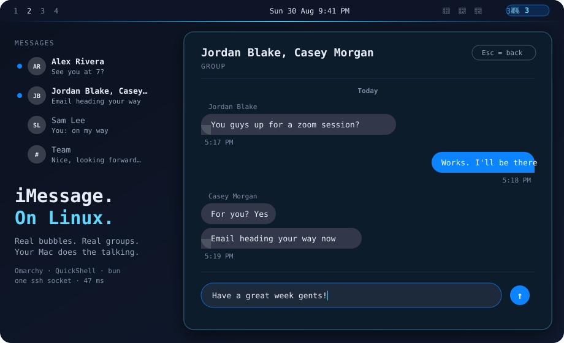
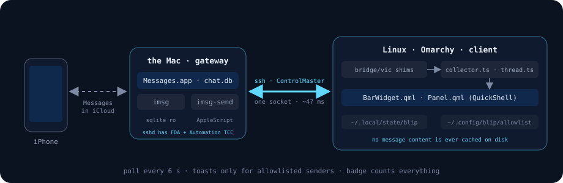

<p align="center">
  
</p>

<h1 align="center">Blip</h1>

<p align="center">
  <b>iMessage. On Linux. For real.</b><br>
  Read, send, group chats, blue dots, desktop toasts — from an Omarchy bar widget.<br>
  Your Mac does the talking. Your Linux box does the living.
</p>

<p align="center">
  
  
  
  
  
</p>

---

## Why this exists

iMessage is macOS-only. Everyone who lives on Linux and owns an iPhone knows the
dance: pick up the phone, unlock it, type on glass, put it down, lose the
thread. BlueBubbles wants SIP off. AirMessage wants a server and a prayer.

Blip does something simpler. **The Mac you already own is the gateway.** It
holds `chat.db` and it can drive Messages.app with AppleScript. Everything else
is one multiplexed SSH socket and a bar widget that looks like it belongs.

No SIP disabled. No daemon on the Mac. No private API. No message cache on the
Linux side. If the Mac is asleep, the widget dims and says so.

## What you get

<table>
<tr>
<td width="50%" valign="top">

**In the bar**
- unread count across every thread
- dims with a slashed glyph when the Mac is unreachable
- left-click panel · middle-click refresh · right-click mark all read

**Thread list**
- avatar initials, name, preview, time
- **blue dot** that stays until you open *that* conversation — iMessage semantics, not "I glanced at the list"
- groups titled the way Messages.app titles them: the group's name, else its members

</td>
<td width="50%" valign="top">

**Conversation**
- real bubbles — yours blue on the right, theirs grey on the left
- grouped into runs with one timestamp per run, day dividers, squared "tail" corner
- sender names above each run in a group
- select text and Ctrl+C · right-click a bubble to copy it whole
- compose box at the bottom, Enter sends — **DMs and groups**

**Toasts**
- desktop notification only for senders on your allowlist
- everything else still counts and still shows; it just doesn't interrupt you

</td>
</tr>
</table>

## How it works

<p align="center">
  
</p>

```
Linux                                         Mac
─────                                         ───
BarWidget.qml  ── every 6 s ──▶ collector.ts ──▶ ssh ──▶ imsg --json recent 150
                                                          (sqlite, read-only)
Panel.qml      ── open thread ─▶ thread.ts   ──▶ ssh ──▶ imsg --json thread <id> 80
Panel.qml      ── Enter ───────────────────────▶ ssh ──▶ imsg-send --to <id> --yes -- "text"
                                                          imsg-send --chat-id "any;+;<guid>" …
                                                          (AppleScript → Messages.app)
```

The trick that makes it possible: **`sshd` on macOS inherits both Full Disk
Access and Automation consent.** `cron` gets neither. So a plain SSH session can
read `chat.db` and tell Messages.app to send, where every scheduled approach
dies at a TCC prompt nobody is there to click.

With `ControlMaster` in `~/.ssh/config`, a round trip is ~47 ms warm. Fast
enough to poll, fast enough that the panel feels local.

## Install

**On the Mac**

1. Copy `bridge/mac/imsg` and `bridge/mac/imsg-send` to `~/bin/`, `chmod +x`.
2. Grant your SSH login Full Disk Access once: *System Settings → Privacy &
   Security → Full Disk Access → sshd* (or the terminal you run `sshd` from).
3. `export IMSG_SELF_HANDLES="+15551234567,you@icloud.com"` in your shell rc
   (used by `imsg-send --self`).
4. Send yourself one message from an SSH session to trigger the Automation
   prompt on the Mac: `imsg-send --self --yes "hello from linux"`. Click OK.

**On Linux**

```sh
# ~/.ssh/config — name the host `fnix` or edit the shims
Host fnix
  HostName <mac-ip-or-tailscale>
  User <you>
  ControlMaster auto
  ControlPath ~/.ssh/cm/%r@%h:%p
  ControlPersist 10m
mkdir -p ~/.ssh/cm

cp bridge/vic/imsg bridge/vic/imsg-send ~/bin/ && chmod +x ~/bin/imsg*
imsg recent 5                                  # if this prints messages, the bridge is up

git clone https://github.com/nixfred/blip ~/.config/omarchy/plugins/nixfred.blip
omarchy-restart-shell
```

Add `{ "id": "nixfred.blip" }` to `bar.layout.right` in
`~/.config/omarchy/shell.json`, restart the shell again, and the speech bubble
is in your bar.

**Toasts**

```jsonc
// ~/.config/blip/allowlist.json — re-read every poll, no restart
{ "allow": ["+15551234567", "them@icloud.com"] }
```

## Keyboard

| where | key | does |
|---|---|---|
| list | `j` / `k` · `↑` / `↓` | move |
| list | `Enter` · `1`–`9` | open thread |
| list | `r` | refresh |
| thread | `Enter` | send |
| thread | `Esc` | back to list (or clear a text selection first) |
| anywhere | `Esc` | close |

IPC, for scripts and other plugins:

```sh
qs -p /usr/share/omarchy/shell ipc call nixfred.blip status
qs -p /usr/share/omarchy/shell ipc call nixfred.blip goto 15551234567   # bare digits
qs -p /usr/share/omarchy/shell ipc call nixfred.blip read               # mark all read
```

## Design notes worth knowing

**Two read marks, not one.** The collector keeps `watermark` (highest timestamp
it has *seen* — drives toasts) separate from `readMark` and per-thread
`readMarks` (highest timestamp *you* have looked at — drives the badge and the
dots). Fold them together and the badge flashes to 1 and resets on the next
poll. Yes, that shipped once.

**Groups send by GUID.** `imsg` reports a group as a bare 32-hex
`chat_identifier`; AppleScript's `chat id` wants the full `any;+;<id>`. A
group's `handle` field is whichever member spoke last — send to *that* and you
DM one person while the panel shows the group. `bridge/vic/imsg groups`
supplies the real GUID; a group whose GUID isn't cached yet is read-only rather
than guessed.

**The self-thread lies.** A message you send yourself lands twice: once
`from_me=true`, once `from_me=false`, same timestamp and text. Every counter and
every bubble runs through `dedupeSelfEcho()` first or your own notes light the
badge forever.

**Deleted means deleted.** macOS keeps deleted messages in a 30-day "Recently
Deleted" bin that is still in `chat.db`. `bridge/mac/imsg` hides those rows, so
a conversation you delete on the phone disappears from Blip within one poll of
the iCloud sync. `IMSG_INCLUDE_DELETED=1` shows them again.

**Nothing personal touches disk on Linux.** `~/.local/state/blip/state.json`
holds timestamps, a toast-dedupe ring, and group names. No message text, ever.
The 273,000-message history stays on the Mac where it lives.

## What it can't do

- **Read receipts.** Tested: opening the conversation on the Mac via
  `open imessage://…` does not flip `is_read`. Needs Apple's private API.
- **Tapbacks, edits, replies-in-thread, outbound attachments.** AppleScript
  can't. If you need those, [BlueBubbles](https://bluebubbles.app) is the
  right tool and requires disabling SIP.
- **Work while the Mac sleeps.** Inherent. The widget dims and tells you.

## Development

```sh
bun test                                     # 93 tests, ~40 ms
bun collector.ts --deep | jq '.unread, (.threads|length)'
bun thread.ts +15551234567 40 | jq '.bubbles[-1]'
```

Logic lives in TypeScript where it can be tested; QML only renders. Every
layout bug so far was found with `grim` and eyeballs, not by reading code —
screenshot your changes. See [CLAUDE.md](CLAUDE.md) for the invariants.

## Credits

Built by Fred Nix and Larry (his Claude Code collaborator) in one evening on
[Omarchy](https://omarchy.org). The Mac-side `imsg` tools predate Blip and are
the reason it took an evening, not a week.

MIT.
